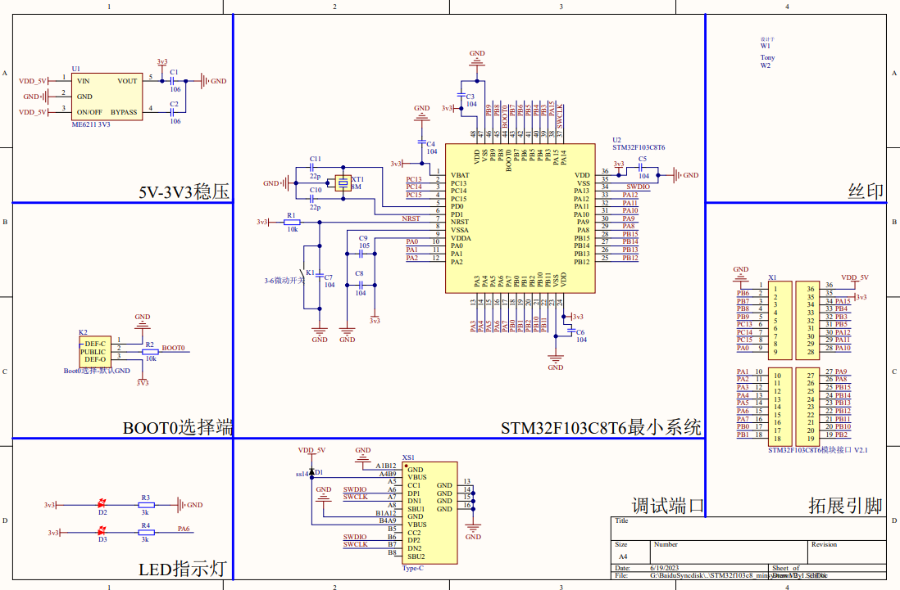
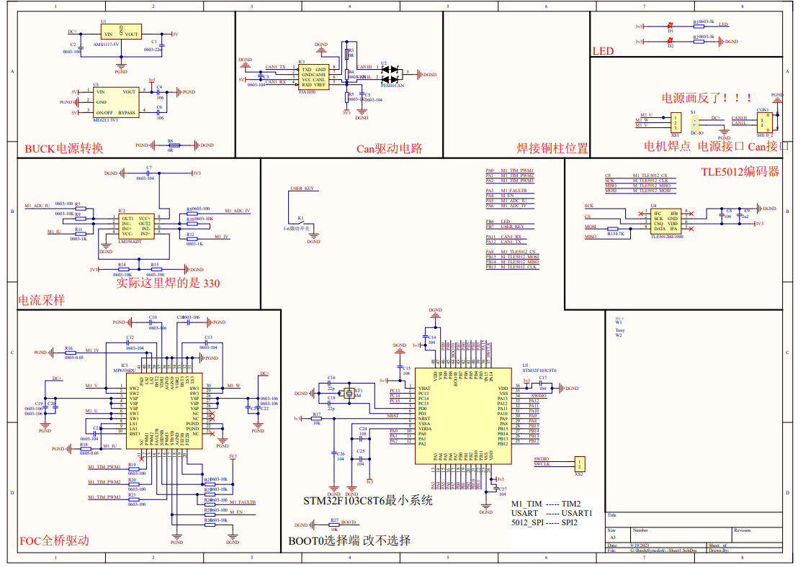
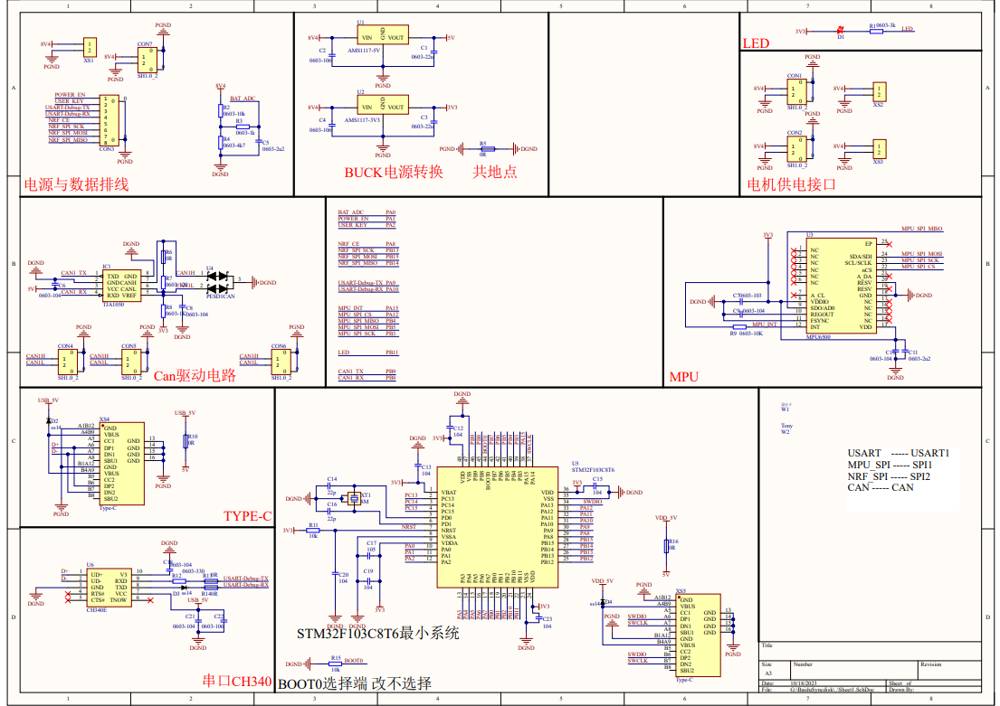
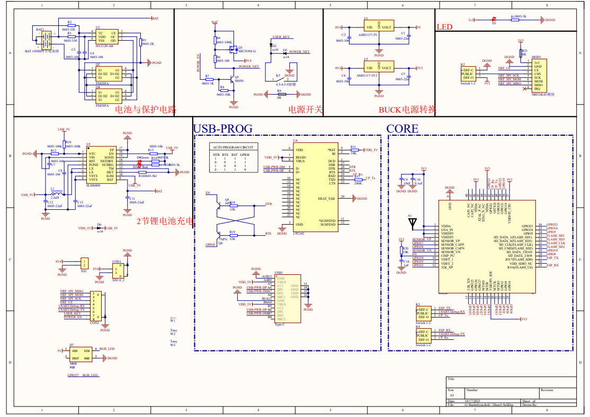

# SMALL_FOC_balanceCar

* 参考手工饭平衡车
* [FOC无刷平衡车，复刻后无需调参数即可丝滑稳定！ - 嘉立创EDA开源硬件平台 (oshwhub.com)](https://oshwhub.com/nokia82/super_balance)

## 1 PCB设计文件

### 1.1 STM32F103C8T6最小系统板

* stm32F103C8T6 minsystem V2.1

### 1.2 1612 电机驱动板_使用stm32F103C8

* F1_ESC_V1.0

### 1.3 主控外设板

* 配套使用 stm32F103C8T6 minsystem V2.1
* mycar_pcb

### 1.4 电源与遥控板

* 使用 ESP32PicoD4 做遥控
* mycar_batchargepcb

